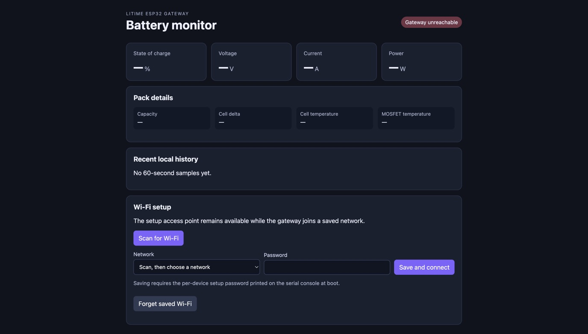
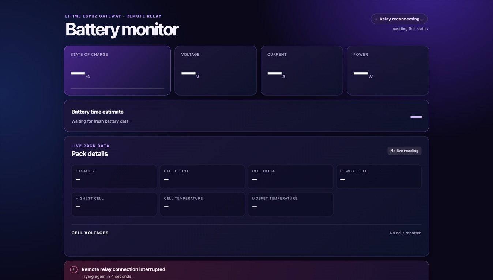

# LiTime ESP32 Gateway Setup

This guide is for a first-time user. You do not need coding or ESP32 experience. You will download this project, install the tools, flash the ESP32, join the gateway setup Wi-Fi, and optionally publish the read-only Cloudflare remote dashboard.

The remote dashboard uses **Cloudflare Workers** with Wrangler. You do not need a `cloudflared` tunnel for this project.

## What You Need

- An ESP32 development board with a USB data cable.
- A Bluetooth-enabled LiTime battery near the ESP32.
- A computer with internet access.
- A home Wi-Fi network for the gateway to join.
- Optional: a Cloudflare account and a domain already active in Cloudflare.

Keep private values out of Git:

- Do not commit `firmware/config.h`.
- Do not commit `.dev.vars`, `.env`, tokens, Wi-Fi passwords, setup passwords, or Cloudflare secrets.
- The repo already ignores the local files used for those values.

## 1. Install The Tools

### macOS

If you do not have Homebrew, install it from [brew.sh](https://brew.sh/). Then open Terminal and run:

```sh
brew install git node arduino-cli
```

### Windows

Install these from their official websites:

- Git: [git-scm.com](https://git-scm.com/)
- Node.js LTS: [nodejs.org](https://nodejs.org/)
- Arduino CLI: [arduino.github.io/arduino-cli](https://arduino.github.io/arduino-cli/)

Then open Git Bash for the commands below. Git Bash comes with Git for Windows and can run the repo's `.sh` scripts.

## 2. Download This Project

Choose a folder where you keep projects, then run:

```sh
git clone https://github.com/TristanEDU/litime-esp32-gateway.git
cd litime-esp32-gateway
```

If you downloaded a ZIP from GitHub instead, unzip it and open Terminal or PowerShell inside the unzipped `litime-esp32-gateway` folder.

## 3. Install ESP32 Support For Arduino CLI

Run these once:

```sh
arduino-cli config init
arduino-cli config add board_manager.additional_urls https://espressif.github.io/arduino-esp32/package_esp32_index.json
arduino-cli core update-index
arduino-cli core install esp32:esp32
```

If `arduino-cli config init` says a config file already exists, continue with the next command.

This project already includes the required NimBLE-Arduino library in `firmware/libraries/`, so you do not need to install a separate BLE library.

## 4. Plug In The ESP32

Connect the ESP32 to your computer with a USB data cable. Then find its serial port:

```sh
arduino-cli board list
```

On macOS, the port usually looks like:

```text
/dev/cu.usbserial-0001
```

On Windows, it usually looks like:

```text
COM3
```

If nothing appears, try a different USB cable. Many charging cables do not carry data.

## 5. Build The Firmware

From the project folder, run:

```sh
./scripts/build.sh release
```

Success means Arduino CLI compiled the ESP32 firmware. This does not flash the ESP32 yet.

## 6. Flash The ESP32

Use the serial port you found earlier.

macOS example:

```sh
./scripts/flash.sh /dev/cu.usbserial-0001 release
```

Windows Git Bash example:

```sh
bash ./scripts/flash.sh COM3 release
```

The flash script writes both the firmware and the small LittleFS web page. If the upload fails, hold the ESP32 `BOOT` button while the upload starts, then release it after the upload begins.

## 7. Save The First Boot Details

After flashing, open the serial monitor:

```sh
arduino-cli monitor -p /dev/cu.usbserial-0001 -c baudrate=115200
```

Use your own port. On Windows, replace the port with something like `COM3`.

Press `Ctrl+C` when you are done watching the serial monitor.

When the ESP32 starts, it prints three important lines:

```text
Setup SSID: LiTime-Gateway-xxxx
Setup password: generated-password-here
Setup address: http://192.168.4.1
```

Write these down. The setup password is unique to that ESP32 and is needed when saving Wi-Fi.

## 8. Join The Gateway Setup Wi-Fi

On your computer or phone:

1. Open Wi-Fi settings.
2. Join the `LiTime-Gateway-xxxx` network printed in the serial monitor.
3. Enter the setup password printed in the serial monitor.
4. Open this address in a browser:

```text
http://192.168.4.1
```

You should see the local gateway page:



The top may show `Gateway unreachable` until your browser is actually connected to the ESP32 page and the device has battery data. The important part for setup is the **Wi-Fi setup** panel.

## 9. Connect The Gateway To Home Wi-Fi

On the gateway page:

1. Select **Scan for Wi-Fi**.
2. When prompted, enter the setup password from the serial monitor.
3. Choose your home Wi-Fi network.
4. Enter your home Wi-Fi password.
5. Select **Save and connect**.

The setup access point remains available even after the ESP32 joins home Wi-Fi, so you can still connect directly during an internet outage.

After the ESP32 joins your network, the page shows the station IP. You can open that IP from devices on the same Wi-Fi.

## 10. Confirm Local Battery Data

Keep the LiTime battery close to the ESP32. The gateway scans for the battery and updates the local page when it receives a valid BLE reading.

Useful checks:

- The connection badge changes from waiting or disconnected to live telemetry.
- Voltage, current, state of charge, and cells populate.
- `/api/battery` returns JSON if you open `http://<gateway-ip>/api/battery`.

If you have local data, the gateway is working without Cloudflare.

## 11. Optional: Set Up The Cloudflare Remote Dashboard

The remote dashboard lets a browser view live battery status through Cloudflare. It is read-only and exposes no battery controls.

Cloudflare references:

- Wrangler config is the source of truth for Worker settings: [Cloudflare Wrangler configuration](https://developers.cloudflare.com/workers/wrangler/configuration/)
- Custom domains use `routes` with `custom_domain: true`: [Cloudflare Custom Domains](https://developers.cloudflare.com/workers/configuration/routing/custom-domains/)
- Secrets should be stored as Worker secrets, not plain variables: [Cloudflare Workers secrets](https://developers.cloudflare.com/workers/configuration/secrets/)

### 11.1 Choose Your Dashboard Hostname

Pick a hostname on a domain you own in Cloudflare, for example:

```text
battery.example.com
```

Open `cloudflare/remote-dashboard/wrangler.jsonc` and change the route pattern to your hostname:

```jsonc
"routes": [
  {
    "pattern": "battery.example.com",
    "custom_domain": true
  }
]
```

Use only the hostname. Do not include `https://` and do not include `/browser` or `/device`.

The repo may currently contain a maintainer's example hostname in this file. Replace it before deploying. Cloudflare Custom Domains also require an active Cloudflare zone, and the hostname cannot already have a conflicting CNAME record.

### 11.2 Install The Worker Dependencies

From the project folder:

```sh
cd cloudflare/remote-dashboard
npm ci
```

### 11.3 Create A Device Token

Generate one long random token. You will put the same token in Cloudflare and in the ESP32 local config.

This command works anywhere Node.js is installed:

```sh
node -e "console.log(require('crypto').randomBytes(32).toString('hex'))"
```

Copy the printed value into a temporary private note. Do not commit it.

### 11.4 Log In To Cloudflare

Run:

```sh
npx wrangler login
```

Wrangler opens a browser window. Sign in to Cloudflare and approve Wrangler.

### 11.5 Save The Worker Secret

Still inside `cloudflare/remote-dashboard`, run:

```sh
npx wrangler secret put DEVICE_TOKEN
```

Paste the token you generated. Cloudflare stores it as an encrypted Worker secret.

### 11.6 Deploy The Worker

Run:

```sh
npm run deploy
```

When deployment finishes, open your dashboard hostname, for example:

```text
https://battery.example.com
```

Before the ESP32 connects, the page looks like this:



That waiting state is normal until the ESP32 is flashed with matching remote dashboard settings and has internet access.

## 12. Enable The ESP32 Remote Dashboard Connection

Return to the project root:

```sh
cd ../..
```

Copy the example config:

```sh
cp firmware/config.example.h firmware/config.h
```

Open `firmware/config.h` in a text editor and set these values:

```cpp
#define GATEWAY_ENABLE_REMOTE_DASHBOARD 1
#define GATEWAY_REMOTE_DASHBOARD_HOST "battery.example.com"
#define GATEWAY_REMOTE_DASHBOARD_PATH "/device"
#define GATEWAY_REMOTE_DASHBOARD_TOKEN "paste-the-same-token-here"
```

Leave `GATEWAY_ENABLE_REMOTE_SYNC` set to `0` unless you are also building your own HTTPS ingest server.

Build and flash again:

```sh
./scripts/flash.sh /dev/cu.usbserial-0001 release
```

Use your own port.

After the ESP32 reconnects to home Wi-Fi, it opens an outbound WebSocket to Cloudflare. No router port forwarding is required.

## 13. Verify The Remote Dashboard

Open your dashboard hostname in a browser:

```text
https://battery.example.com
```

Expected states:

- `Relay reconnecting` or `Awaiting first status`: the browser reached Cloudflare, but the ESP32 is not connected yet.
- `Requesting live status`: the browser relay is open and asking for the latest battery status.
- `Live BLE telemetry`: Cloudflare, the ESP32, and the LiTime BLE connection are all working.

For an idle recovery check, close all remote dashboard browser tabs for at least ten minutes, then reopen the dashboard. It should recover without restarting the ESP32.

## Troubleshooting

### `arduino-cli board list` shows nothing

Try a known data USB cable, another USB port, or the ESP32 board's USB driver. Some ESP32 boards use CH340 or CP210x USB chips.

### Upload fails or times out

Hold the ESP32 `BOOT` button when the upload starts. Release it once the terminal shows upload progress.

### The setup Wi-Fi does not appear

Reset the ESP32 and watch the serial monitor again. Confirm the setup SSID printed at boot. The setup access point name is generated per device.

### The setup page asks for a password

Use the setup password printed in the serial monitor. The username is `admin` if your browser asks for both username and password.

### The local page works but the remote dashboard does not

Check these in order:

1. `cloudflare/remote-dashboard/wrangler.jsonc` uses your hostname.
2. Cloudflare has the `DEVICE_TOKEN` secret.
3. `firmware/config.h` has `GATEWAY_ENABLE_REMOTE_DASHBOARD 1`.
4. `GATEWAY_REMOTE_DASHBOARD_HOST` matches the hostname without `https://`.
5. `GATEWAY_REMOTE_DASHBOARD_TOKEN` is exactly the same token saved in Cloudflare.
6. The ESP32 has joined home Wi-Fi.

### Do I need port forwarding?

No. The ESP32 makes an outbound connection to Cloudflare. Your router does not need inbound port forwarding, UPnP, or a public ESP32 IP.

## What To Keep

After setup, keep these private values somewhere safe:

- The ESP32 setup SSID and setup password.
- The Cloudflare dashboard hostname.
- The device token used for `DEVICE_TOKEN` and `GATEWAY_REMOTE_DASHBOARD_TOKEN`.
- The serial port name for your ESP32, if it stays the same on your computer.

If the token is exposed, generate a new one, update the Cloudflare `DEVICE_TOKEN` secret, update `firmware/config.h`, and flash the ESP32 again.
